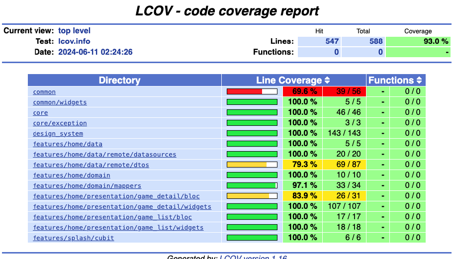

# PlayStation 5 - Game List

A new Flutter project.

## Getting Started

This project is a starting point for a Flutter application that lists games available for
PlayStation 5.

### Prerequisites

Make sure you have the following installed:

- [Flutter](https://flutter.dev/docs/get-started/install)
- [Dart](https://dart.dev/get-dart)
- [melos](https://melos.invertase.dev/getting-started)

### Installation

1. **Clone the repository:**

    ```sh
    git clone https://github.com/your-username/playstation-5-game-list.git
    cd playstation-5-game-list
    ```
   
2. **Add the .env file:**

   Create a `.env` file in the root directory of the project and add the following content:

    ```env
    BASE_URL=https://api.rawg.io/api/
    KEY=02ef6ba5d13444ee86bad607e8bce3f4
    ```
3. **Install dependencies:**

    ```sh
    melos get
    ```
   
4. **Build the project:**

    ```sh
    melos build
    ```

5. **Generate localization files:**

    ```sh
    melos generate-locale
    ```

6. **Run the application:**

    ```sh
    flutter run
    ```

### Project Structure

```
lib/
├── common/
├── core/
│   ├── exception/
│   └── design_system/
├── features/
│   ├── home/
│   │   ├── data/
│   │   │   └── remote/
│   │   ├── domain/
│   │   └── presentation/
│   └── splash/
├── generated/
```

### Features

- [x] List of PlayStation 5 games
- [x] Game details view
- [ ] Search functionality

### Code Coverage


